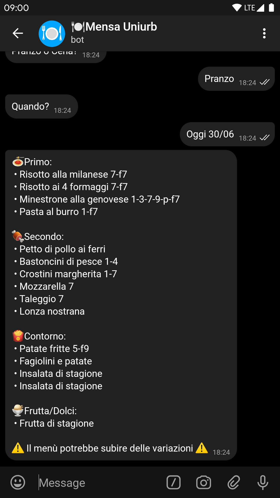

# Mensa Uniurb #

Il progetto serve a semplificare e rendere più immediata la consultazione del menù della mensa Uniurb, che attualmente corrisponde a un brutto form e una tabella HTML.
Nel tempo abbiamo sviluppato diverse componenti per rendere questo progetto didattico e riutilizzabile oltre alla semplice consultazione da parte degli utenti.

Questa repository è composta da tre parti principali:

* Bot &rarr; Bot telegram realizzato in Python tramite la libreria [Telepot](https://github.com/nickoala/telepot).
* App &rarr; Mobile app realizzata in [Flutter](https://flutter.dev).
* API &rarr; Acquisisce e converte i dati in un formato facilmente utilizzabile e accessibile. Realizzato in Python con l'ausilio della liberia [Flask](http://flask.pocoo.org).

## Se il progetto ti è stato utile in qualunque modo, offrici una birra ##

------------------------------------------------------------------------------------

Tutto quello che trovate in questa repository è stato sviluppato da noi a scopo educativo. Ne Uniurb ne Erdis Urbino sono responsabili in alcun modo.
